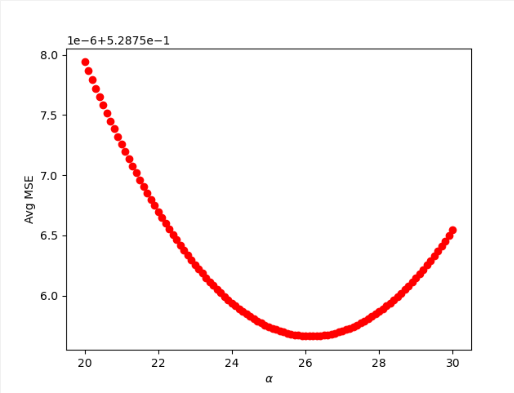

## Midterm Corrections

#### Question 15

After loading the dataset and defining my DoKFold function (see [question 18](<#question 18>)), I created a dataframe containing the features and target of the data. To find the correlation 
coefficients of each features variable as it was related to the target, I used the ```corr()``` function and found that Median Income (MedInc) had the highest correlation.

#### Question 16

To standardize the features of the dataset, I imported StandardScalar and used the ```fit_transform()``` function to standardize the features. Then I created a dataframe with the transformed data and added the target values to the dataframe. After calculating the correlations on the scaled set, I found that the correlations from the previous question do not change. 

#### Question 17

To calculate the coefficient of determination, I used ```corrcoef()``` function from the NumPy library with the scaled feature variable identified in question 15, MedInc, as the feature and the original target from the dataset. I squared the correlation coefficient and rounded the value to 2 decimals places which resulted in a coefficient of determination of 0.47.
```
np.round(np.corrcoef(x_scaled['MedInc'],y)[0][1]**2, decimals=2)
```

#### Question 18

In order to run Linear, Ridge, and Lasso regression models on the data using KFold cross validation, I defined a function that would perform each regression while collecting the testing and training scores. After importing KFold and StandardScalar, I defined the KFold function using the specified parameters in the function call. 
```
kf = KFold(n_splits=k, shuffle=True, random_state=146)
```
I defined empty arrays that would store the training and testing scores and MSE values for each fold. Then I started a for loop which would run the KFold cross validation for the specified model for each fold. I set the feature and target training and testing data based on the indices for training and testing data set by the KFold function. I then standardized the features if specified in the parameters. I fit the model to the training data and appended the training and testing scores of the model. 

To calculate MSE, I squared the difference between the actual and predicted training and testing values of the dataset. I took the mean of the values and appended it to the arrays of MSE values for each fold. 
```
ytrain_pred = model.predict(Xtrain)
ytest_pred = model.predict(Xtest)

train_mse.append(np.mean((ytrain-ytrain_pred)**2))
test_mse.append(np.mean((ytest-ytest_pred)**2))
```
Finally, I returned the training and testing scores and MSE value arrays. 

To find the R^2 value on the test folds, I ran DoKFold with the parameters set as specified in the question. Then I calculated the mean of the test scores array, which was 0.60198. 

#### Question 19

To perform a ridge regression on the data, I imported the Ridge Regression function, defined the alpha range, and defined empty arrays where the training and testing scores would be stored. Then I created a for loop to run the ridge regression for each alpha value in the indicated range over the DoKFold function. For each loop, I appended the testing and training scores and MSE values. After running the regression, I found the index of the maximum testing score to determine the optimal alpha value. Thus, the R^2 value of the testing folds was 0.60201 for the optimal alpha value, which was 25.8.


#### Question 20

Similar to the previous question, I imported the Lasso Regression, defined the alpha range, and defined empty arrays where the training and testing scores would be stored. Then I created a for loop over which the regression would be run for each possible alpha value while performing a KFold cross validation. After running the regression over the entire alpha range, I found the optimal alpha value to be 0.00186 with a testing score of 0.60213. 


#### Question 21

In finding the model that estimates the smallest coefficient for the variable that is least correlated to the target, I determined that the index number for the variable (AveOccup) was 5, which was used to determine the coefficient from each regression. I fit each type of model on the scaled data, defining the optimal alpha value if needed. Then I found the coefficient in the 5th index for each respective model. 

Linear regression: -0.0393

Ridge regression: -0.0394

Lasso regression: -0.376

Thus, the Ridge regression estimates the smallest coefficient for the variable that is least correlated to the target.

#### Question 22

Similar to the previous question, I found the index for the variable which is most correlated to the target (MedInc) which was 0. I extracted the first value for each model's list of coefficients and found the following values:

Linear regression: 0.8296

Ridge regression: 0.8288

Lasso regression: 0.8200

Thus, the Lasso regression estimates the smallest coefficient for the variable that is most correlated to the target.

#### Question 23

To determine the optimal alpha value for a Ridge regression based on MSE, I found the index for the minimum MSE value in the array of testing MSE values for a Ridge regression and determined the coordinating alpha value. The minimum MSE was 0.60201 and the optimal alpha value was 26.1, which was different from the alpha value found when using R^2, thus a different alpha value is found when using MSE as opposed to R^2.



#### Question 24

Similar to the previous question, I found the minimum MSE value for the testing dataset, which was 0.60213. Using the coordinating index, I found the optimal alpha value to be 0.00186. 


