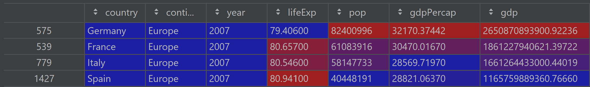

## Project 1

#### Describe what is a package? Also, describe what is a library? What are the two steps you need to execute in order to install a package and then make 
that library of functions accessible to your workspace and current python work session?

A package is a set of related classes and functions. A package will also contain a constructor function. A library is a collection of packages that must be imported at the 
beginning of each coding session to be utilized. To install a package, you must import the library to which it is contained and then import the specific package you need. 
For example, you can install the pandas library as so:
```
import pandas as pd
```
By importing pandas as "pd", you can reference pd in your code as you call functions within the library. Rather than typing the entire library name when calling a function,
you can simply use "pd", saving you time. You can also install a specific function from a package if you know you will only use one function. For example:
``` 
from datetime import datetime
```

#### Describe what is a data frame? Identify a library of functions that is particularly useful for working with data frames. In order to read a file in its remote location within the file system of your operating system, which command would you use? Provide an example of how to read a file and import it into your work session in order to create a new data frame. Also, describe why specifying an argument within a read_() function can be significant. Does data that is saved as a file in a different type of format require a particular argument in order for a data frame to be successfully imported? Also, provide an example that describes a data frame you created. How do you determine how many rows and columns are in a data frame? Is there an alternate terminology for describing rows and columns?

A data frame is an array or table of information in which the columns represent variables and the rows represent observations. The Pandas library is particularly useful for working with data frames. In order to read a file in its remote location, you can use read_csv() within 
the pandas library. 
```
df = pd.read_csv(foldername\name_of_file)
```
Data that is saved in a different format may use a different read function. For example, read_html() is used to read an html file. Specifying the type of file to be read 
indicates the reader function which converts the data into something that can be read and processed in a python file. However, files similar to csv, tsv for example, can
be specified in the argument of the function by adding the seperation as "\t". (https://pandas.pydata.org/pandas-docs/stable/user_guide/io.html)
```
data = pd.read_csv(path_to_data, sep = '\t')
```
To count the rows and columns in a data frame, you can use .shape command, which will give the number of rows, then columns. Rows and columns may also be known as observations and variables.

#### Import the gapminder.tsv data set and create a new data frame. Interrogate and describe the year variable within the data frame you created. Does this variable exhibit regular intervals? If you were to add new outcomes to the raw data in order to update and make it more current, which years would you add to each subset of observations? Stretch goal: can you identify how many new outcomes in total you would be adding to your data frame?

The year variable has 12 unique instances: 1952, 1957, 1962, 1967, 1972, 1977, 1982, 1987, 1992, 1997, 2002, 2007. This variable exhibits a regular interval of 5 years. To make the data more current, you would add 2012, and 2017. Since there are 142 unique countries in the data frame, by making the data more current you would add 284 new outcomes. 

#### Using the data frame you created by importing the gapminder.tsv data set, determine which country at what point in time had the lowest life expectancy. Conduct a cursory level investigation as to why this was the case and provide a brief explanation in support of your explanation.

The country with the lowest life expectancy in the data frame was Rwanda in 1992, which had a life expectancy of 23.599. To find this data, I found the index of the minimum life expectancy in the data and then used that index to find all information about that particular observation. This is due to an increasingly violent civil war in Rwanda which escalated into a genocide in the 1990s. 

#### Using the data frame you created by importing the gapminder.tsv data set, multiply the variable pop by the variable gdpPercap and assign the results to a newly created variable. Then subset and order from highest to lowest the results for Germany, France, Italy and Spain in 2007. Create a table that illustrates your results (you are welcome to either create a table in markdown or plot/save in PyCharm and upload the image). Stretch goal: which of the four European countries exhibited the most significant increase in total gross domestic product during the previous 5-year period (to 2007)?



Germany had the most significant increase in total gross domestic product during the previous 5-year period. 

#### You have been introduced to four logical operators thus far: &, ==, | and ^. Describe each one including its purpose and function. Provide an example of how each might be used in the context of programming.

The AND operator, &, is used when both statements must be true for the overall conditional statement to be true. For example, if you are looking for observations within a data set which come from 2007 and Italy, you would use the & operator. 

The equals operator, ==, is used to compare two values, variables, or other pieces of data. For example, if you want to test if a user's input is equal to a certain value in order to perform a command, you would use this operator.

The OR operator, |, is used when at least one of the statements in a conditional statement must be true for the statement to be true. If both are true, the statement still holds. For example, if you are trying to find which observations in a data set are from Italy or have a population over 1 million, you could subset the data by finding the observations where the country equals Italy OR the population is greater than 1 million. 

The XOR operator, ^, is used when only one of the statements in a conditional statement must be true for the statement to be true. If both are true, the statement is false. In other words, either statement 1 is true or statement 2 is true. For example, if you are trying to determine ____.


