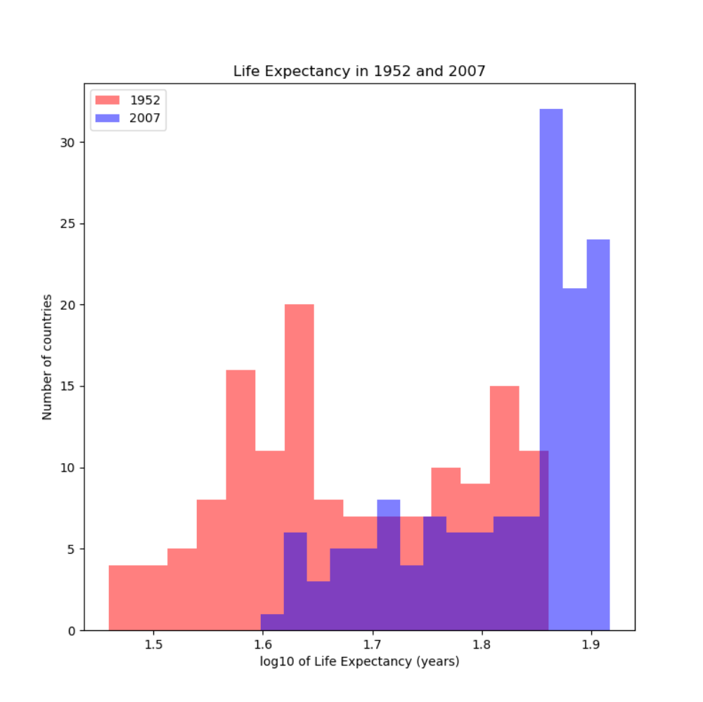

## Project 2

#### Question 1: Types of Data

Continuous data is numerical and has a range of values. Magnitude is meaningful so arithmetic is often performed on this type of data. For example, age and temperature are both continuous data. Ordinal data can be numerical but has a system of order or rank, so arithmetic is not used on this data. An academic year or place in a race are both examples of ordinal data. Nominal data is categorical and is not represented numerically, but can be for the purpose of making a model. Gender or country are both examples of nominal data; gender could also be represented by 0 and 1.

A model representing life expectancy has features for disposable income, level of education, and gender. Disposable income, which is continuous, will have a coefficient less than 1, but may be an indicator of level of health care. Level of education is represented by ordinal data in varying sets of rank which numerically increases as the level of education increases. Finally, gender, though nominal, can be represented with 0 and 1. 

#### Question 2

mean: 0.5116517070232738; median: 0.5165611482584342

mean: 0.16290616802718505; median: 0.12689898795018337

mean: 0.832621828753045; median: 0.8670896455700469

For the first plot, I had my alpha and beta values set at 5 and 5 which produced a relatively balanced distribution. For the right skewed plot, I decreased the alpha value to 1 while keeping beta value the same. Likewise for the left skewed plot, I switched the alpha and beta values, so `a=5.0` and `b=1.0`.

#### Question 3

The first plot shows the raw data from the gapminder set describing life expectancy in 1952 and 2007. The second plot shows the data after a logarithmic transformation in which I created a new observation in the original dataset representing the log10 of life expectancy, and then subset the data again based on the indices for 1952 and 2007. Though both plots show that there are more countries in 2007 with a higher life expectancy, the logarithmic transformation shows a more drastic contrast between the life expectancy of 1952 and 2007. However, it is important to note that the first plot shows that life expectancy in 1952 was more right skewed while that of 2007 was more left skewed. From the graph of raw data, it is more difficult to see the distinction between the two years. 

#### Question 4

The first plot shows a box and whiskers plot of the population for all countries for each given 5-year interval. The second plot, however, shows the data after a logarithmic transformation. The data for the first plot is within a given range with a few outliers. The inclusion of these outliers makes the overall plot harder to analyze and interpret. After the logarithmic transformation, there is a clearer distinction of the descriptive statistics of population for each 5-year period, making it easier to see how population has changed over time. 
