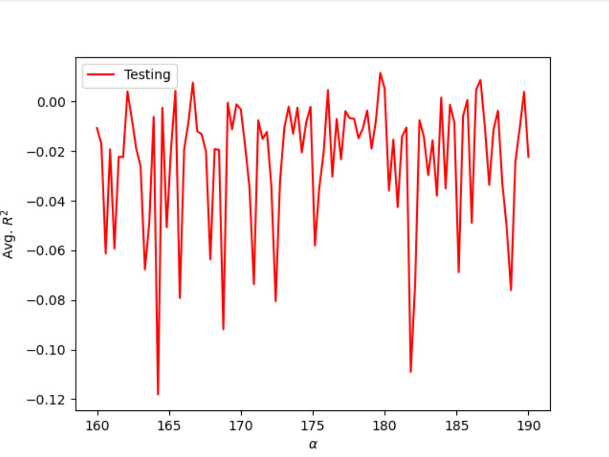
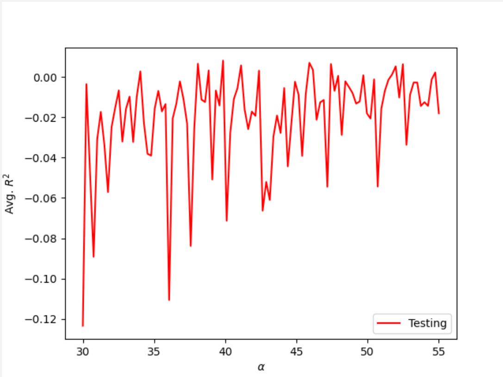
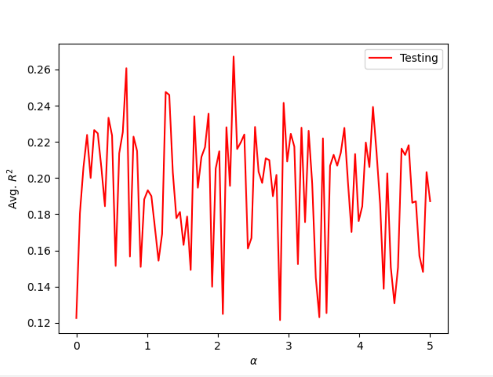
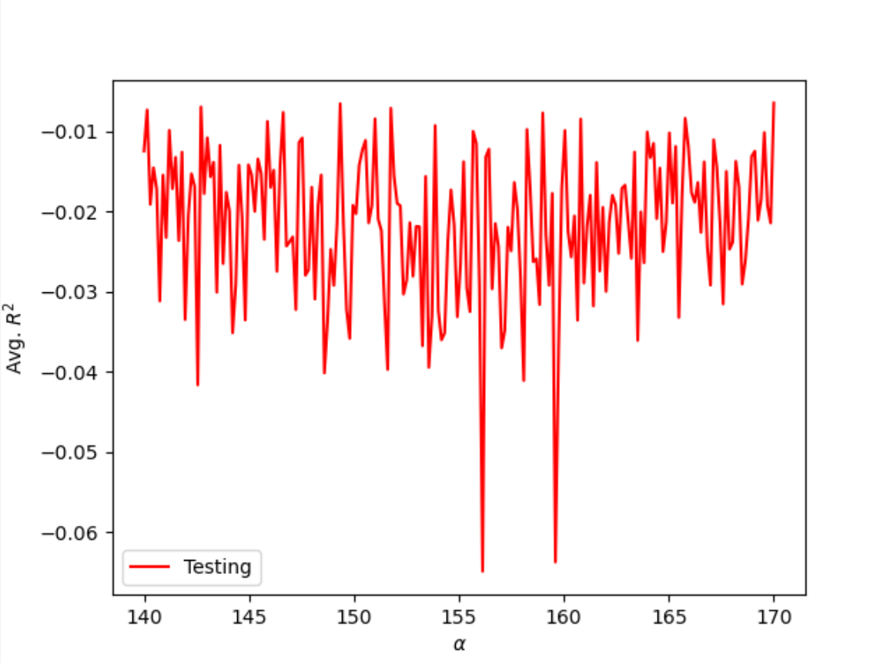
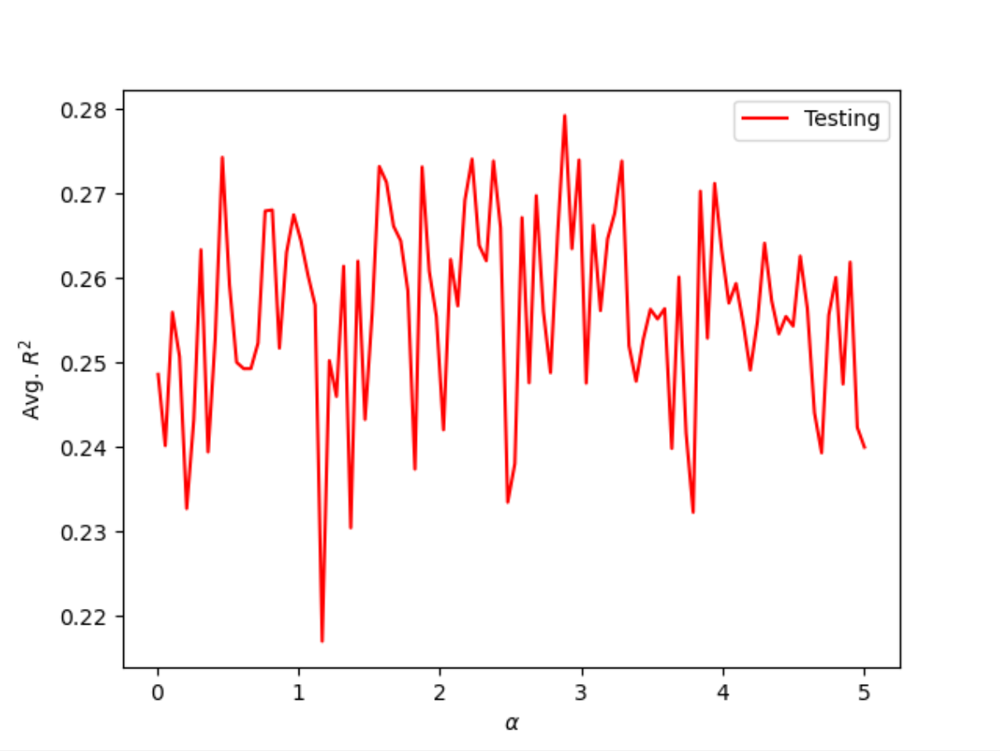

## Project 3

#### KFold Linear Regression Model for Charleston Home Asking Price

To train and test the model for the data from ```charleston_ask.csv```, I set the target as the price variable and the features as the number of beds, baths, and square feet of the property. When testing and training a model using KFold, I split the data into a number of different folds, ranging from 7 to 25. All had similar results:

| number of folds | training score | testing score |
| --------------- | ------------- | -------------- |
| 7 | 0.019 | -0.051 |
| 10 | 0.019 | -0.049 |
| 15 | 0.019 | -0.123 |
| 20 | 0.019 | -0.106 |
| 25 | 0.019 | -0.042 |

In general, though the training score fluctuated slightly as the number of folds changed, there was no significant improvement of training or testing scores as the number of folds increased. In addition, the overall scores were not indicative of a well performing model. 

#### Standardizing Features

The previous results of creating a Linear Regression model were unsuccessful in producing a good model of the data, likely in part due to the range of numbers of area of property in square feet, which was much greater than that of the other two features. In an effort to try to improve testing and training scores, I standardized the features of the model using StandardScalar. After scaling the features, I ran a KFold linear regression loop over the data. 

| number of folds | training score | testing score |
| --------------- | ------------- | -------------- |
| 7 | 0.020 | -0.008 |
| 10 | 0.020 | -0.011 |
| 15 | 0.019 | -0.034 |
| 20 | 0.019 | -0.075 |
| 25 | 0.019 | -0.184 |

Though the results improved slightly, standardizing the features of the model did not significantly improve the testing and training scores. Thus, another type of regression or the use of more variables may help improve the model.

#### Ridge Regression Model

Rather than use a Linear Regression Model, I tried a Ridge Regression, which would find the optimal alpha value for the model. I first set the range of values to test as (0, 200, 200). After running the regression several times over the data, I found that optimal alpha values were concentrated at 40 and 180, so I changed the range to further investigate both values. When subsetting the range to (30, 55), I found optimal alpha values to be 33.333, 39.848, and 35.556 all with testing and training scores of approximately 0.019 and 0.009, respectively. I also tested the ridge regression with a range of (160, 190) and found optimal alpha values to be 178.894, 182.727, and 163.333 with very similar training and testing scores as the previous range. Though the training and testing scores indicate that the ridge regression was not a very accurate representation of the model, it was still an improvement from the previous linear regression models. 

  

#### Modeling Charleston Home Actual Price

| number of folds | training score | testing score | training score (S) | testing score (S) |
| --------------- | ------------- | -------------- | ---| --- |
| 7 | 0.004 | -0.009 | 0.004 | -0.013 |
| 10 | 0.004 | -0.023 | 0.004 | -0.023 |
| 15 | 0.004 | -0.022 | 0.004 | -0.032 |
| 20 | 0.004 | -0.041 | 0.004 | -0.019 |
| 25 | 0.004 | -0.052 | 0.004 | -0.051 |

For the dataset ```charleston_act.csv```, I performed a KFold Linear Regression Model over the data with and without standardizing the data. Similar to the data for asking price of homes, the linear regression model did not perform well for this dataset. Though the training scores were similar, the testing scores were lower than the previous dataset. Thus, using a different set of data did not improve our ability to create a model representing the price (asking or actual) of a home. 

I also performed a Ridge Regression on the actual price dataset and received better results. After running the regression over a range of (0, 200), I found a number of optimal alpha values from 140 to 200. After narrowing my range, I found optimal values of 164.121, 144.221, and 168.643 all with training and testing scores of 0.004 and -0.004. Though this model did not perform as well as the asking price data, the results of the training and testing scores indicate that this model performed better than the linear regression model, similar to the previous dataset. 



#### Adding Additional Variables to the Model Features

In an effort to improve the performance of the model, I included the remaining variables in the datasets, which included zipcodes. Shown below are the training and testing scores from running a Linear Regression using KFold for both datasets, and while standardizing the data. 

Asking Price of Charleston Homes
| number of folds | training score | testing score | training score (S) | testing score (S) |
| --------------- | ------------- | -------------- | ---| --- |
| 7 | 0.282 | 0.233 | 0.282 | 0.222 |
| 10 | 0.281 | 0.224 | 0.281 | 0.194 |
| 15 | 0.280 | 0.186 | 0.280 | 0.062 |
| 20 | 0.280 | 0.111 | 0.280 | 0.066 |
| 25 | 0.279 | -0.117 | 0.279 | -0.116 |


Actual Price of Charleston Homes
| number of folds | training score | testing score | training score (S) | testing score (S) |
| --------------- | ------------- | -------------- | ---| --- |
| 7 | 0.343 | 0.245 | 0.343 | 0.255 |
| 10 | 0.339 | 0.237 | 0.339 | 0.200 |
| 15 | 0.338 | 0.240 | 0.338 | 0.217 |
| 20 | 0.338 | 0.215 | 0.338 | 0.206 |
| 25 | 0.337 | 0.223 | 0.337 | 0.234 |


\[Note: After receiving extremely low testing scores for the actual price data after standardizing, I removed outliers from the testing scores to improve the overall mean performance of the model and to more easily compare the modeling methods. The extreme difference in model predictability could be due to variability or negotiations that can occur when selling a house. While asking prices are likely based off of what other local homes have sold for or are currently on the market for, competition among possible buyers or a buyer's personal value of the home may lead to vastly different actual selling prices, making a model's predictability harder to remain consistent.] 

As shown above, there was a significant increase in the training and testing scores for both datasets having used the remaining variables. Though the scores still do not indicate a great model, there is improvement in how well the models produced can represent the data. 

When performing Ridge Regressions over the data, I used a similar approach as before-starting with range of (0, 200) and then narrowing the range as it best fit the optimal alpha values. For the asking price data, I found that there were a number of values from (0, 5) including 4.242 (training-0.265, testing-0.230), 3.333(0.269, 0.261), and 1.364(0.278, 0.254). For the data representing actual prices of homes, there was also a cluster of optimal values between 0 and 5. Some values include 1.533(0.335, 0.281), 2.312(0.331, 0.287), and 1.784(0.333, 0.282). Athough the training and testing scores were not as consistent within the single set of data, they were significantly better than the previous Ridge Regression models.

 

#### Final Thoughts and Considerations

Finally, consider the model that produced the best results. Would you estimate this model as being overfit or underfit? If you were working for Zillow as their chief data scientist, what action would you recommend in order to improve the predictive power of the model that produced your best results from the approximately 700 observations (716 asking / 660 actual)?

Overall, the use of more variables drastically improved the predictive power of each type of model. In context of the data, a zipcode can indicate the type of neighborhood, quality of public school system, and landscape, all of which can be indicators of the value of a home. For this reason, the zipcode features became a very valuable piece of data when trying to fit a model. The model that produced the best results was the Ridge Regression Model, specifically for the actual price data when all features were utilized. Based on the results of the training and testing scores, the model was overfit. Though the scores were not that of a strong model and indicate an overall underfit model, the training scores amoung different alpha values were relatively consistent while the testing scores were lower. The model likely was fit as best as it could given the data but resulted in a poor model when predicting values for the testing set.

To improve the predictive power of the model, I would include more observations and features to produce a more robust model. Some other variables that could be included would be quality of local education, the year when it was built, or size of outdoor space. In addition, other regression models, such as a lasso regression, may improve the model's fit. 

