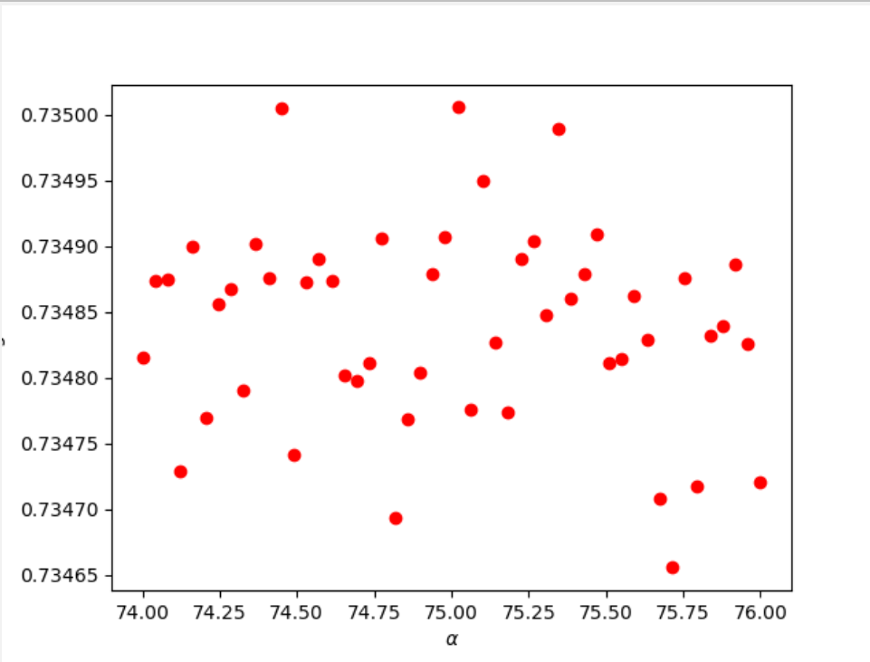

## Project 5 Part 1

### Regression over Dataset with WealthC as Target

In the preprocessing stage, I checked for and removed nan values in the data, which appeared in approximately 80 observations. Because the dataset consists of about 48000 observations, the removal of 80 did not significantly impact the data modeling. I also dropped ```wealthC``` and ```wealthI``` from the data as they would be used as the target variables.

#### Linear Regression

To perform a linear regression, I set up my DoKFold function ([described here](midterm.md)) ([described here](#question-18)) ([described here](midterm.md#question-18)) and set the number of folds to 20. It is important to note that I changed the k value several times but did not see a significant change in the MSE and R^2 values. To continue, I ran the linear regression with 20 folds for the standardized and unstandardized dataset. The unstandarized set had a minimum testing MSE value of 0.41745 and an average testing MSE value of 0.44376. Likewise, the standardized data had a minimum testing MSE value of 0.42096 and an average of 0.44378. Even after standardizing the data, both regression performed relatively similarly. 

Upon calculating the correlation matrix for the data, I found that that of the original dataset and the standardized set were the same.

#### Ridge Regression

Initially, I set the alpha range to (0, 100) to determine a smaller range that may contain an optimal alpha value. I was able to find that there were relatively high testing scores at approximately 20 and 75. After working with smaller ranges and increasing the number of cuts in the range, I was able to find two optimal alpha values. Though most alpha values had similar testing scores from the ridge regression, the plots below show that a few values in particular stood out. 


maybe redo (0, 25)

alpha = 75.02040: training score-0.73552; testing score-0.73500; train MSE-0.44330; test MSE-0.44405

#### Lasso Regression

Since Lasso Regressions often have significantly smaller alpha values, I set my inital range to (0, 2) and found optimal alpha values closer to 0. As I lowered and decreased the range, I found that the testing scores continued to increase. Ultimately, I found that the optimal alpha value was 0.000021, as shown in the plot below.


alpha = 0.000021; training score-0.73531; testing score-0.73472; train MSE-0.44365; test MSE-0.44441

Overall, both regression proved to be successful in modeling the data accurately as testing and training scores remained consistently high throughout the modeling process. This indicates that ```wealthC ``` may be a reasonable target to represent the dataset. 

### Regression over Dataset with WealthI as Target

#### Linear Regression

Similarly to the Linear Regression when WealthC was the target, I ran the linear regression over the original dataset and standardized data with 20 folds. After running the regression, I found that the minimum testing MSE was 1.6x10^9 and the average was 1.7x10^9. Likewise for the standaridized set, the minimum was 1.6x10^9 and the average was 1.7x10^9. The significant shift in MSE values is likely due to the change in range of numbers of the target variable. Where WealthC had a range of (1,5), WealthI had a range of approximately (-150000, 475000). 

As with WealthC as the target, the correlation coefficients did not change after standardizing the data.

#### Ridge Regression

Similar to when ```wealthC``` was the target, I first ran the ridge regression over a large range, (0, 100) to determine where optimal alpha values may be clustered. I found that there were increased testing scores on the data at approximately 3 and 85. I narrowed the range and found two optimal alpha values as shown below:


alpha = 3.45614; training score-0.82582; testing score-0.82536; train MSE-1750292038.1575; test MSE-1754099888.5952

alpha = 85.43037; training score-0.82528; testing score-0.82486; train MSE-1755727661.6856; test MSE-1759202034.1834

#### Lasso Regression

Similar to the process of using lasso regression in the previous example, I used a larger range with a smaller number of cuts to initally find possible alpha values. In doing so, I found possible alpha values cluster at 1. I narrowed the range to (0.8, 1.2) and further narrowed the range and increased the number of cuts to find the optimal alpha value for the data. 


---

### Final Thoughts

Overall, though the MSE values from the Linear Regression model were significantly worse when ```wealthI``` was the target, the results from the Ridge and Lasso regression were consistently better than when ```wealthC``` was used as the target. After testing several different models with subsequent alpha value ranges, the best model resulted from the Lasso regression with ```wealthI``` as the target and ```a= ```. As shown in the above explanations, this model had the greatest training and testing score values which was consistent for similar alpha values. 


5:rid wealth c 73.26530612244898 0.735536599394592 0.7349837466712954 0.4432891665668458 0.4440465506710101
6:rd wealth c 75.0204081632653 0.7355293400183553 0.7350057659737123 0.4433014330380833 0.44405245411322963
7: lasso c 0.00025 0.7136339380713137 0.7131444208894668 0.4800011233039849 0.48035115656967176
8:las c 2.1034482758620692e-05 0.7353161045156538 0.7347215387705568 0.4436585480357807 0.44441573245416216
9:rid i 3.4561403508771926 0.8258254555993014 0.825364052942596 1750292038.1575189 1754099888.5952823
10:rid i 85.43037974683544 0.8252845633760625 0.8248692926446278 1755727661.685636 1759202034.1834388

