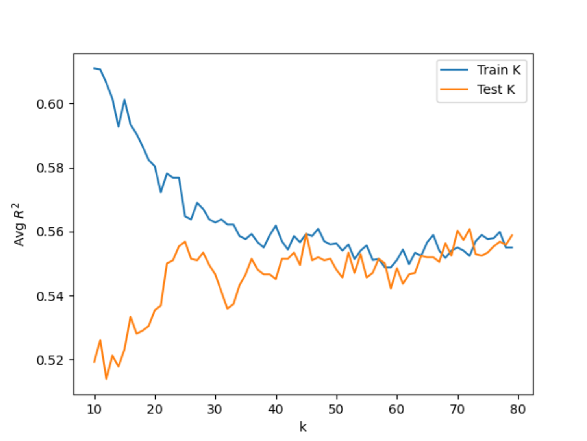
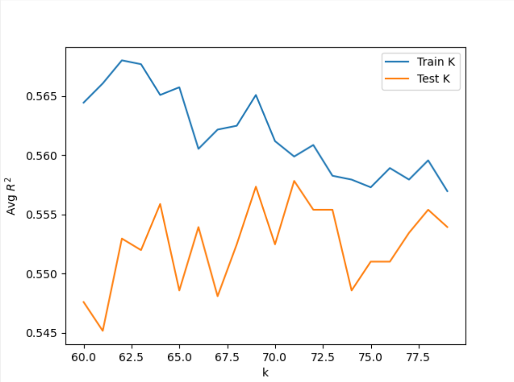
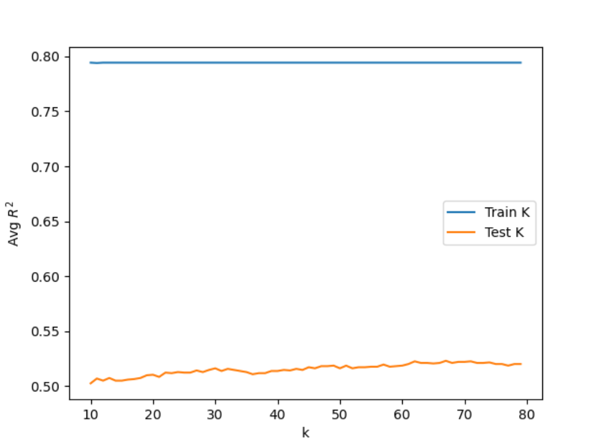
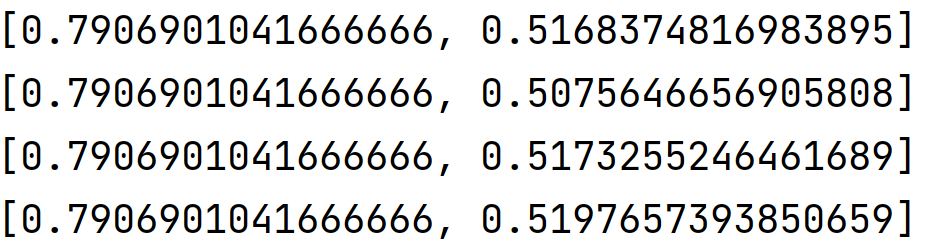
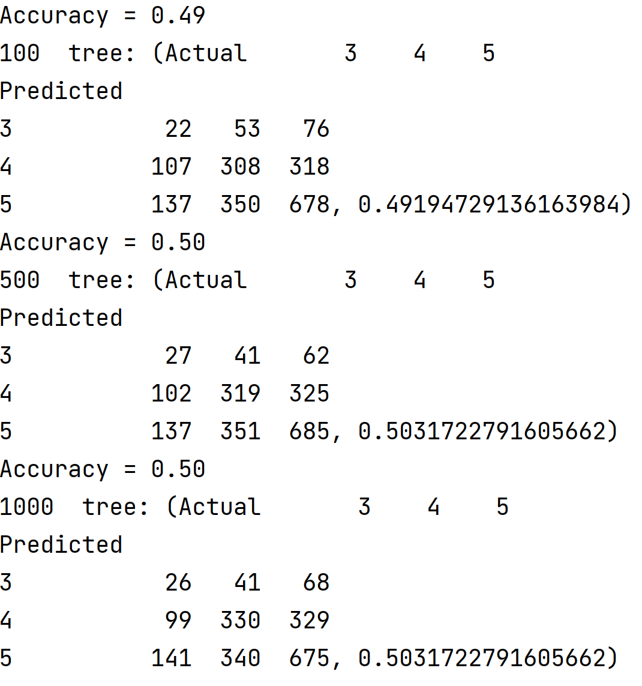
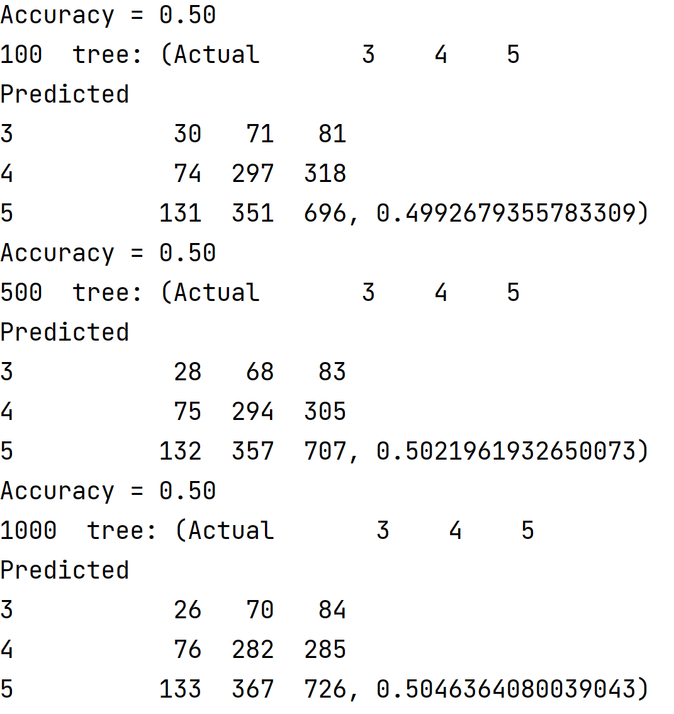
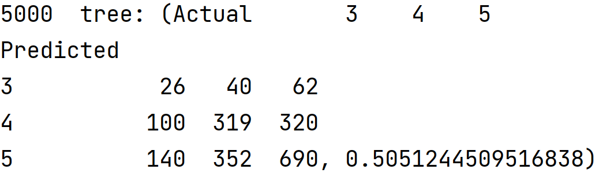
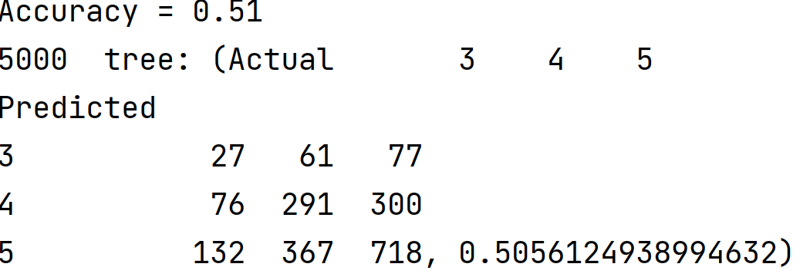

## Project 5, Part 2

### Modeling Dataset with WealthC as Target

In the preprocessing stage, I imported the data using ```pd.read_csv()``` and dropped nan values from the dataset, which accounted for 2 observations of approximately 5,000. I also changed the datatype of the age and education features from float to int. I then dropped ```wealthC``` from the dataset to assign the features to ```X``` and the target, ```wealthC```, to ```y```.

#### K-nearest Neighbors Classification

After importing the necessary commands and libraries, I found ```Xtrain, Xtest, ytrain, ytest``` from running ```GetData()``` over the dataset, which ran ```train_test_split()``` over the scaled features and target data. I set the ```k_range``` to (10, 80). Then I ran the KNN Classification over the data for each value in the k range. In each iteration, I appended the training and testing scores to an array which was used to find the best value of k based on the highest testing score. For the initial range I tested, the maximum testing score was 0.55832 at ```k=73```. Based on this finding and the results from running the KNN Classification several times, I narrowed the range to (70, 80). After running KNN over the smaller range, I found a maximum testing score of 0.5500 at ```k=77```. Shown below are the plots of the training and testing scores of the KNN Classification for the two ranges. 

     

In effort to try improving the training and testing results, I ran the KNN Classification over a range of (70, 80) with distance as a weight. Though the training scores improved, the maximum testing score stayed relatively similar. I found the maximum testing score to be 0.50268 with ```k=73```. Since the training scores improved but the testing scores did not, the KNN model may be overfit when using distance as a weight. Additionally, there may be little significance of distance if the points are relatively evenly spaced from eachother. 


#### Logistic Regression

For the Logistic Regression, I ran ```GetData(scale = True)``` over the dataset to obtain the training and testing split. Then I ran the Logistic Regression over the training dataset and found the training and testing scores for the model. I found the average training and testing scores to be 0.54796 and 0.55002 respectively. Thus, the Logistic Regression had approximately the same accuracy as the KNN model for the testing data, but did worse for the training data. 

#### Random Forest Model

I started by setting the ```n_range=[100, 500, 1000, 5000]``` and running the RFC with the number of estimators set as each value in the n-range. Then I fit the model and found the training and testing scores. I ran this loop over the range several times to determine which value of n consistently performed the best on the testing dataset. Though all performed relatively similarly, ```n=1000``` consistently performed the best. The training and testing scores are shown below for each value in ```n_range```.


To test the minimum number of samples required to split an internal node, I set the ```n_range``` to (20, 30) and ran RFC over the values, setting the number of estimators to 1000 and the minimum number of samples to each n in the range before fitting the model. I appended the training and testing scores for each n-value and found that 28 and 29 performed the best having run the loop several times-both values had a testing score of 0.544 and training scores of approximately 0.65. 

For the Random Forest Model, I did not initally scale the data when determining the training and testing datsets. I later scaled the data when determining the training and testing datasets and compared the results: 

accuracy of classification for scaled data and unscaled data

   

   

### Modeling Dataset with Recoded WealthC Target

Similar to the preprocessing that was done for the original dataset, I removed nan values and recast the datatypes for the age and education features. However, I recoded the ```wealthC``` variable to combine classes 2 and 3. To do this, I created a copy of the original data and found the indices where ```wealthC``` was equal to 2. Then I set the ```wealthC``` value to 3 for these observations. Finally, I subset the data for X and y. 

#### K-Nearest Neighbors Classification

Similar to the KNN process for the original dataset, I split the dataset into training and testing sets using ```GetData(scale = True)```. Then I set the ```k_range``` to (10, 80) and found the maximum testing score to be 0.56076 at ```k=72```. I then narrowed the range to (60, 80) and found a maximum testing score of 0.55783 at ```k=71```. 

  

After adding distance as a weight to the KNN Classification, I found that the optimal k-value decreased, as did the testing scores. The maximum testing score was 0.52318 at ```k=67```. Thus, adding distance as a weight did not significantly improve the accuracy of the model. 



#### Logistic Regression

For the Logistic Regression, I fit the model over the scaled training dataset and calculated the training and testing scores. After running the regression several times, I found the average training and testing scores to be 0.54806 and 0.55278, respectively. Compared to the results of the KNN Classification, the accuracy of the models are very similar. 

#### Random Forest Model

Similarly to the process used for the original dataset, I fit the Random Forest Model over the training set for each given number of estimators: 100, 500, 1000, 5000. After running the loop several times, I found that ```n=5000``` consistently performed the best based on the testing scores. This change in an optimal number of estimators may be due to the decrease in number of classes. Since there were only 3 classes in the recoded target, more estimators may have been needed to predict the ```wealthC``` value. 



To find the minimum number of samples required to split an internal node, I fit RFC to the training data with the ```min_samples_split``` set to n over a range of (20, 30). After running the loop multiple times, I found the best n-value to be 28 or 29, which each had testing scores of 0.544. 

Similar to the previous dataset, I initially used an unscaled dataset for the Random Forest Model, but upon comparing it to the scaled testing and training set, found that the accuracy of the two models was nearly the same. 

accuracy of classification for scaled and unscaled data

   

   

---
### Final Thoughts

Overall, each model had testing scores of approximately 0.50, with varying training scores. We saw that adding distance as a weight for the KNN model and running a Random Forest Classification over each dataset signficantly improved the training scores while the testing scores remained the same or decreased. These models were likely overfit, and thus did not perform as accurately. However, the KNN model without weight consistently performed well, especially after recoding the target. The KNN model with the recoded target performed the best, with a testing score of 0.56, when the number of neighbors was 72 and the data was scaled. In addition, the training score was similar for this model, ruling out the likelihood that the model was overfit. By condensing the classification for this dataset, the KNN model was able to more easily distinguish between each class and thus, improve the accuracy of the model. 

