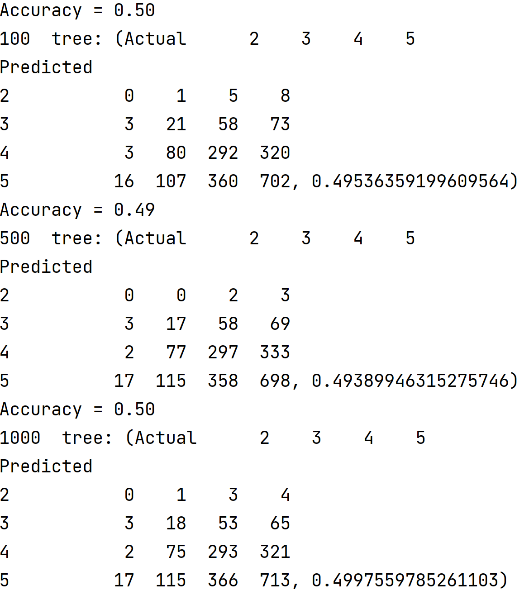

## Project 5, Part 2

### Modeling Dataset with WealthC as Target

In the preprocessing stage, I imported the data using ```pd.read_csv()``` and dropped nan values from the dataset, which accounted for 2 observations of approximately 5,000. I also changed the datatype of the age and education features from float to int. I then dropped ```wealthC``` from the dataset to assign the features to ```X``` and the target, ```wealthC``` to ```y```.

#### K-nearest Neighbors Classification

After importing the necessary commands and libraries, I found ```Xtrain, Xtest, ytrain, ytest``` from running ```GetData()``` over the dataset, which ran ```train_test_split()``` over the scaled features and target data. I set the ```k_range``` to (10, 80). Then I ran the KNN Classification over the data for each value in the k range. In each iteration, I appended the training and testing scores to an array which was used to find the best value of k based on the highest testing score. For the initial range I tested, the maximum testing score was 0.55832 at ```k=73```. Based on this finding and the results from running the KNN Classifcation several times, I narrowed the range to (70, 80). After running KNN over the smaller range, I found a maximum testing score of 0.5500 at ```k=77```. Shown below are the plots of the training and testing scores of the KNN Classification for the two ranges. 

     

In effort to try improving the training and testing results, I ran the KNN Classification over a range of (70, 80) with distance as a weight. Though the training scores improved, the maximum testing score stayed relatively similar. I found the maximum testing score to be 0.50268 with ```k=73```. 


#### Logistic Regression

For the Logistic Regression, I ran ```GetData(scale = True)``` over the dataset to obtain the training and testing split. Then I ran the Logistic Regression over the training dataset and found the training and testing scores for the model. I found the average training and testing scores to be 0.54796 and 0.55002 respectively. Thus, the Logistic Regression had approximately the same accuracy as the KNN model for the testing data, but did worse for the training data. 

#### Random Forest Model

I started by setting the ```n_range=[100, 500, 1000, 5000]``` and running the RFC with the number of estimators set as each value in the n-range. Then I fit the model and found the training and testing scores. I ran this loop over the range several times to determine which value of n consistently performed the best on the testing dataset. Though all performed relatively similarly, ```n=1000``` consistently performed the best. The training and testing scores are shown below for each value in ```n_range```.


To test the minimum number of samples required to split an internal node, I set the ```n_range``` to (20, 30) and ran RFC over the values, setting the number of estimators to 1000 and the minimum number of samples to each n in the range before fitting the model. I appended the training and testing scores for each n-value and found that 28 and 29 performed the best having run the loop several times-both values had a testing score of 0.544 and training scores of approximately 0.65. 

For the Random Forest Model, I did not initally scale the data when determining the training and testing datsets. I later scaled the data when determining the training and testing datasets and compared the results: 

accuracy of classification for scaled data and unscaled data
   
   

### Modeling Dataset with Recoded WealthC Target


#### K-Nearest Neighbors Classification

#### Logistic Regression

#### Random Forest Model

---
### Final Thoughts
min num splits for random forest: 28 or 29
28 0.5446559297218155
29 0.5436798438262567 most training scores were .65 ish
img 4: table of scaled data when performing rfc, n=100
5: table of training and testing scores for rfc for (100, 500, 1000, 5000)  compare to 6, 7 (scaled)

2&3 combined
8:knn range (10, 80) max test score 72, 0.5607613469985359
9: knn range (60, 80) max test score 71, 0.5578330893118595
10: knn with weight range (10, 80) 67, 0.5231820400195217
0.5485026041666666, 0.5490483162518301; 0.5465494791666666, 0.5539287457296243 log regression

11: rfc all were close n=5000 consistently performed better
min num splits for random forest 29 or 28
29 0.5436798438262567
28 0.541727672035139
12, 13: scaled rfc with 100, 500, 1000, 5000 compare with 11??

